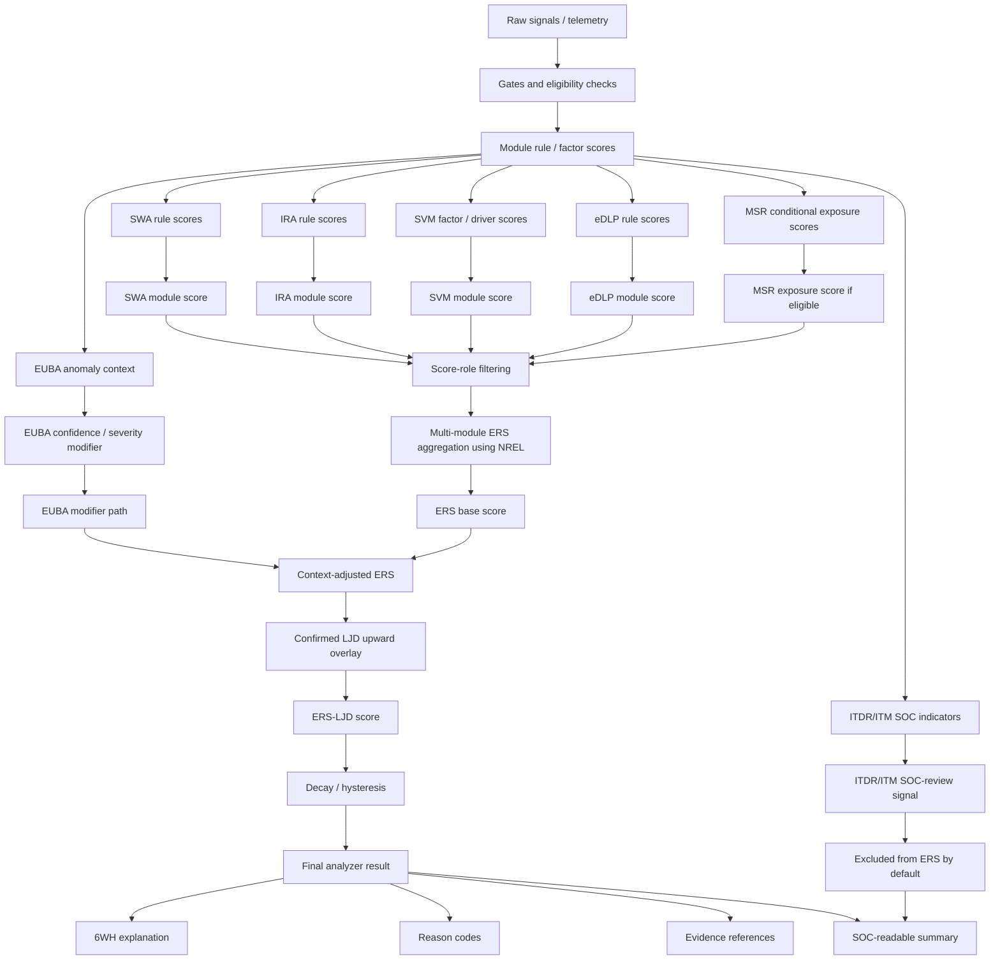

# Trendzact Exposure Risk Rating Engine
## ERS-LJD Cross-Module Risk Analyzer

**Status:** Final working draft
**Scope:** Exposure Risk Score (ERS), Localized Jump Detection (LJD), cross-module normalization, Secure Workspace Assurance (SWA), Identity Recognition Assurance (IRA), Secure Virtual Meetings (SVM), Exposure DLP (eDLP), ITDR/ITM, EUBA confidence/severity modifier, analyzer output contract
**Primary use:** Edge/SOC analyzer design, implementation planning, validation, and knowledge transfer

---

# 1. Executive Summary

Trendzact should adopt a unified **Exposure Risk Rating Engine** based on the following analyzer sequence:

```text
raw signals / telemetry
→ gates and eligibility checks
→ module rule/factor scores
→ per-module risk aggregation
→ normalized module scores
→ multi-module ERS aggregation
→ EUBA confidence/severity modifier
→ context-adjusted ERS
→ confirmed LJD upward overlay
→ decay / hysteresis
→ final analyzer result
→ 6WH explanation, reason codes, and evidence references
```

The engine has three core scoring layers:

| Layer                              | Purpose                                                      |
| ---------------------------------- | ------------------------------------------------------------ |
| **ERS — Exposure Risk Score**      | Stable baseline exposure posture across active, eligible exposure-risk modules. |
| **LJD — Localized Jump Detection** | Upward-only overlay that detects sudden localized changes and can raise the final analyzer score when confirmation gates pass. LJD may call EUBA when EUBA is licensed and available. |
| **EUBA risk modifier**             | Confidence and severity modifier for existing exposure alerts based on behavioral context. In the current WinApp/SOC instruction path, this is represented as `eubaRiskModifier`, an integer modifier applied only when an exposure-risk condition already exists. |

The analyzer returns a score only. It does not assign the final rating.

The final analyzer model is:

```text
ERS_base = NREL(active exposure-risk module scores)

ERS_context_adjusted = min(100, ERS_base + EUBA_risk_modifier)

ERS_LJD = max(ERS_context_adjusted, confirmed_jump_floor)

final_analyzer_score = Decay(ERS_LJD)
```

The playbook is **not part of the analyzer scoring sequence**. The playbook is a downstream consumer of `final_analyzer_score` and other Analyzer metadata.

---

# 2. Analyzer Boundary

## 2.1 Analyzer responsibility

The analyzer is responsible for:

```text
score
normalize
contextualize
stabilize
explain
```

The analyzer returns the following outputs in workflow sequence:

```text
active modules
module scores
EUBA + Alert History modifier
LJD overlay state
decay state
final analyzer score
triggered rules
reason codes
evidence references
6WH context
SOC-readable summary
```

Logical flow:

| Sequence | Analyzer output        | Purpose                                                      |
| -------- | ---------------------- | ------------------------------------------------------------ |
| 1        | `active_modules`       | Identifies which licensed, active, eligible modules participated in the analyzer run. |
| 2        | `module_scores`        | Shows the normalized per-module scores produced before cross-module aggregation. |
| 3        | `EUBA_modifier`        | EUBA modifies confidence and severity for an existing exposure-risk condition. It does not create exposure risk by itself. |
| 4        | `LJD_overlay_state`    | Shows whether a confirmed localized jump raised the analyzer score. |
| 5        | `decay_state`          | Shows whether decay or hysteresis affected the displayed score. |
| 6        | `final_analyzer_score` | Returns the final numeric analyzer score after ERS, EUBA, LJD, and decay processing. |
| 7        | `triggered_rules`      | Lists the rules or factors that contributed to the scoring result. |
| 8        | `reason_codes`         | Provides compact machine-readable explanations for why the score was produced. |
| 9        | `evidence_references`  | Links the score and rules to supporting telemetry, events, media, or audit artifacts. |
| 10       | `6WH_context`          | Provides who, what, when, where, why, how, and how much context for investigation. |
| 11       | `SOC_readable_summary` | Provides a concise analyst-facing explanation of the analyzer result. |

## 2.2 EUBA (Out of Scope, added for reference)

EUBA modifies confidence and severity for an existing exposure-risk condition. It does not create exposure risk by itself.

EUBA should evaluate both current behavioral context and recent alert-history context.

```text
EUBA_context_inputs =
    environmental_context
    application_context
    time_context
    role_context
    endpoint_context
    session_context
    alert_history_context
```

Alert-history context helps distinguish between expected patterns and unusual changes in exposure behavior.

Examples:

| Alert-history pattern | EUBA interpretation                                          | Possible modifier behavior                                   |
| --------------------- | ------------------------------------------------------------ | ------------------------------------------------------------ |
| Repeat/Recur          | The current alert resembles a previously observed recurring pattern, such as a user performing the same risky workflow every Sunday at 2:00 PM. | May reduce confidence lift or leave severity unchanged if the pattern is explainable and previously reviewed. |
| Emerging              | The user had no alerts for 30 days, then generated 5 alerts today. | May increase confidence/severity because the current exposure activity is unusual for the user’s recent history.Burst |
| Burst                 | Alert count or severity is increasing over recent windows.   | May increase severity modestly, subject to cap.              |
| Repeat                | The same rule repeatedly fires across sessions, apps, files, or meetings. | May increase confidence that the behavior is persistent rather than incidental. |

Recommended alert-history metrics:

```text
alerts_last_24h_rolling
alerts_last_3d
alerts_last_7d
alerts_last_15d
days_since_last_alert
same_rule_repeat_count
same_context_repeat_count
alert_velocity_delta
alert_severity_trend
historical_escalation_match
recurring_pattern_match
```

Example EUBA modifier logic:

```text
EUBA_alert_history_score =
    NREL(active alert-history anomaly metrics, alpha=0.10, top_k=3)

EUBA_risk_modifier =
    bounded_modifier(
        behavioral_context_score,
        alert_history_score,
        modifier_cap
    )
```

EUBA remains bounded:

```text
ERS_context_adjusted = min(100, ERS_base + EUBA_risk_modifier)
```

EUBA can increase confidence or severity when alert history suggests the current exposure event is unusual, persistent, escalating, or newly suspicious. EUBA should not independently create an exposure alert when `ERS_base = 0`.

## 2.3 Playbook Responsibility (Out of Scope, added for reference)

The playbook is a downstream consumer of the Analyzer metadata.

The playbook may consume:

```text
final_analyzer_score
reason_codes
module context
triggered rules
evidence references
```

The playbook converts the analyzer score into a rating / severity band and independently determines response actions. 

```text
final_analyzer_rating = PlaybookRatingLookup(final_analyzer_score)
# example: 95 -> "critical"
```

The playbook may then select or execute response actions, but those actions are outside the analyzer scope.

```text
Analyzer responsibility:
score, normalize, contextualize, stabilize, explain.

Playbook responsibility:
consume analyzer result, apply Exposure Score Rating and select/execute response actions.
```

------

# 3. Final Decisions

## 3.1 Adopt ERS-LJD

Adopt ERS-LJD as the final exposure-risk analyzer model.

```text
ERS_context_adjusted = min(100, ERS_base + EUBA_risk_modifier)

LJD_jump_score = NREL(active localized jump metrics, alpha=0.15, top_k=3)

confirmed_jump_floor =
    LJD_jump_score
    if P_jump >= 0.95
       and uncertainty <= uncertainty_threshold
       and persistence_or_hard_policy_gate_passed
       and benign_context_gate_passed
    else 0

ERS_LJD = max(ERS_context_adjusted, confirmed_jump_floor)
```

Basic LJD algorithm:

| Step | LJD workflow                                             | Purpose                                                      |
| ---- | -------------------------------------------------------- | ------------------------------------------------------------ |
| 1    | Select active localized jump metrics                     | Use only metrics that are available, eligible, and relevant to the current exposure context. |
| 2    | Compare current metric values to the local baseline      | Identify sudden change against the user, endpoint, application, meeting, workspace, or data context. |
| 3    | Score each jump metric from 0–100                        | Convert localized deviations into normalized jump-severity scores. |
| 4    | Aggregate jump metrics with NREL                         | Preserve the strongest jump signal while allowing limited lift from corroborating jump evidence. |
| 5    | Estimate jump confidence                                 | Produce `P_jump`, the confidence that the observed spike is a real localized jump rather than normal variation. |
| 6    | Apply uncertainty, persistence, and benign-context gates | Suppress noisy, transient, or explainable spikes unless a hard-policy condition applies. |
| 7    | Produce `confirmed_jump_floor`                           | Return a score floor only when the jump is confirmed. Otherwise return `0`. |
| 8    | Apply LJD as upward-only overlay                         | Raise the score only when `confirmed_jump_floor` exceeds `ERS_context_adjusted`. |

ERS remains the stable exposure posture baseline. LJD is not a replacement for ERS; it is a confidence-gated upward overlay.

LJD can raise the analyzer score. It cannot lower the analyzer score.

## 3.2 Adopt NREL for normalization

Use **NREL — Normalized Max + Evidence Lift** as the default aggregation operator for:

| Layer | Use |
|---|---|
| Rule/factor → module | Normalize rule and factor scores into a module score. |
| Module → ERS | Normalize active exposure-risk module scores into ERS_base. |
| Jump metrics → LJD | Normalize localized jump evidence into a jump score. |

## 3.3 Use score roles

Use the same 0–100 score shape across modules, but separate scores by role.

| Score role            | Meaning                               | Score source                                                 | ERS behavior          |
| --------------------- | ------------------------------------- | ------------------------------------------------------------ | --------------------- |
| `exposure_risk`       | Direct exposure risk                  | Module rule/factor metrics from SWA, IRA, SVM, eDLP, and conditional MSR exposure signals. | Included in ERS       |
| `confidence_modifier` | Modifies alert confidence/severity    | EUBA behavioral context, baseline match, anomaly confidence, and current `eubaRiskModifier` signal. | Not included directly |
| `anomaly_context`     | Behavioral context / anomaly evidence | EUBA anomaly metrics, baseline deviation, user/role/session mismatch, and related behavioral signals. | Not included directly |
| `soc_indicator`       | SOC-review indicator                  | ITDR/ITM signatures, insider-threat patterns, investigation signals, and SOC escalation indicators. | Not included directly |
| `evidence_quality`    | Evidence completeness / audit quality | MSR coverage, recording availability, screen/display visibility, sensor completeness, and evidence integrity metrics. | Conditional           |
| `overlay`             | Upward-only overlay                   | LJD localized jump metrics, jump confidence, persistence gates, and hard-policy jump evidence. | Applied after ERS     |
| `state_control`       | Decay / suppression / hold state      | Decay timers, hysteresis state, suppression windows, prior displayed score, and alert-stability counters. | Applied after scoring |

## 3.4 Risk-affecting module scope

The analyzer scope includes all risk-affecting modules, but not all modules contribute to ERS in the same way.

| Module | Analyzer role | Default score role | Direct ERS contributor? |
|---|---|---|---:|
| **SWA — Secure Workspace Assurance** | Workspace exposure control | `exposure_risk` | Yes |
| **IRA — Identity Recognition Assurance** | Identity confidence and presence assurance | `exposure_risk` | Yes |
| **SVM — Secure Virtual Meetings** | Meeting exposure control | `exposure_risk` | Yes |
| **eDLP — Exposure Data Loss Prevention** | Data movement / channel exposure control | `exposure_risk` | Yes |
| **ITDR/ITM — Insider Threat Detection and Response / Insider Threat Management** | Insider-threat signature and investigation signal | `soc_indicator` | No by default |
| **EUBA — Entity/User Behavior Analytics** | Behavioral anomaly context | `confidence_modifier` / `anomaly_context` | No direct contribution |
| **MSR — MultiScreen Recording** | Evidence and display coverage | `evidence_quality` or conditional `exposure_risk` | Conditional |

## 3.5 Keep ITDR/ITM outside ERS

ITDR remains a SOC-reviewable insider-threat indicator, not a direct ERS contributor by default.

## 3.6 Use EUBA as modifier, not standalone ERS source

EUBA may affect alert confidence and severity when exposure already exists.

EUBA must not create an exposure alert by itself.

## 3.7 Keep playbook outside analyzer

The analyzer outputs the final result. The playbook consumes the analyzer result independently.

---

# 4. Core Tenets

## 4.1 ERS is the stable baseline

ERS measures current exposure posture across active exposure-risk modules.

ERS must remain stable when:

- modules are added
- modules are removed
- modules are licensed but dormant
- modules are unlicensed
- only one module is active
- multiple modules are active

Inactive or unlicensed modules are excluded from ERS calculation. They are not treated as zero.

## 4.2 Multiple modules can contribute to ERS

Multiple modules may contribute to ERS only when they are:

```text
active
eligible
confidence-valid
score_role = exposure_risk
not excluded by gate
```

Eligible modules contribute through NREL, not raw addition.

## 4.3 Each module owns its internal aggregation

Each module aggregates its own rule/factor scores into a normalized 0–100 module score.

Default:

```text
module_score = NREL(active module rule/factor scores, alpha=0.15, top_k=3)
```

## 4.4 LJD is an overlay

LJD detects sudden localized deviations from expected context.

LJD may raise the final score only when:

- jump severity is high enough
- posterior confidence is high enough
- uncertainty is low enough
- persistence or hard-policy criteria pass
- context does not explain the spike as benign

LJD can raise ERS. It cannot lower ERS.

## 4.5 EUBA modifies confidence/severity

EUBA answers:

```text
Does the current exposure event look behaviorally normal or abnormal
for this user, role, endpoint, time, application, and context?
```

EUBA should not say:

```text
Risk is high because the user is anomalous.
```

EUBA should say:

```text
This exposure alert is more or less credible/severe because
the surrounding behavior is abnormal or normal for this context.
```

## 4.6 Critical signals must not be averaged away

A critical module result must remain visible.

The final ERS base must never fall below the strongest active exposure-risk contributor.

```text
ERS_base >= max(active exposure-risk module scores)
```

## 4.7 Supporting evidence should matter, but not dominate

Multiple moderate signals should increase risk modestly.

They should not create false criticals through additive over-compounding.

NREL solves this by adding only a limited lift from supporting evidence.

## 4.8 The model must be edge-efficient

The edge should run:

- gate checks
- simple rule scoring
- bounded factor scoring
- NREL normalization
- EUBA modifier application
- LJD lightweight confirmation where available
- persistence counters
- reason-code generation

Cloud/SOC should own:

- baseline refresh
- cohort estimation
- threshold calibration
- validation
- governance
- model release control

---

# 5. NREL — Normalized Max + Evidence Lift

## 5.1 Purpose

NREL is the default risk aggregation operator.

It preserves the strongest signal and adds a small, capped lift when supporting signals corroborate risk.

Plain-language explanation:

```text
Start with the highest active risk signal.
Then add a small, capped lift when other active signals support it.
Never let weak supporting signals overwhelm the strongest signal.
Never let inactive modules change the score.
```

## 5.2 Formula

```text
inputs = active scores in [0, 100]

m = max(inputs)

support = RMS(top_k(inputs excluding one instance of m))

lift = (100 - m) × alpha × (support / 100)

NREL = round(min(100, m + lift))
```

## 5.3 Default parameters

| Layer | `alpha` | `top_k` | Purpose |
|---|---:|---:|---|
| Rule/factor → module | 0.15 | 3 | Small corroboration lift inside a module. |
| Module → ERS | 0.25 | 4 | Moderate lift when multiple exposure modules agree. |
| Jump metrics → LJD | 0.15 | 3 | Confirm jump evidence without noisy over-escalation. |
| SVM factor support | 0.10 | 3 | Keep factor-only support subordinate to named drivers. |
| SVM final score | 0.15 | 3 | Lift SVM score only when multiple meeting drivers corroborate. |

## 5.4 Why NREL replaces plain nRSS/RMS

The earlier ERS concept used:

```text
nRSS = round(sqrt(sum(score²) / N))

ERS = max(nRSS, highest_active_module_score)
```

This is stable and explainable, but under-compounds.

Because RMS is always less than or equal to the maximum input:

```text
max(RMS(scores), max(scores)) = max(scores)
```

So plain RMS plus max floor preserves the worst active score but does not materially lift risk when multiple corroborating signals are present.

NREL keeps the useful properties of RMS and max-floor scoring while adding controlled support lift.

---

# 6. Unified Analyzer Sequence

## 6.1 Full sequence

```text
raw signals / telemetry
→ gates and eligibility checks
→ module rule/factor scores
→ per-module risk aggregation
→ normalized module scores
→ multi-module ERS aggregation
→ EUBA confidence/severity modifier
→ context-adjusted ERS
→ confirmed LJD upward overlay
→ decay / hysteresis
→ final analyzer result
→ 6WH explanation, reason codes, and evidence references
```

## 6.2 Step 1 — Raw signals / telemetry

The engine starts with endpoint, identity, workspace, meeting, behavior, and exposure telemetry.

Examples:

```text
identity state
sensitive content visibility
application / file / label
screen share state
meeting participants
observer / phone / object detection
clipboard / print / USB activity
foreground transitions
behavioral baseline signals
```

## 6.3 Step 2 — Gates and eligibility checks

Before scoring, each module must pass activation and scoring gates.

Examples:

```text
module licensed
module active
sensitive content visible
in virtual meeting
screen sharing active
identity signal available
minimum evidence quality met
privacy / jurisdiction gate passed
```

Modules that are inactive, unlicensed, or context-ineligible are excluded from scoring. They are not scored as zero.

## 6.4 Step 3 — Module rule/factor scores

Each module calculates internal rule, factor, or driver scores.

Examples:

```text
IRA: identity mismatch, verification age, confidence collapse
SWA: sensitive visible, observer, phone, clipboard, print, USB
SVM: sensitivity, audience, trust gap, recording, display surface
MSR: unintended display exposure, evidence completeness
EUBA: anomaly score, baseline deviation, behavioral mismatch
eDLP: clipboard, print, USB, upload, browser transfer, sync
ITDR/ITM: SKIM, FLIP, BULK, EXCESS
```

Each rule/factor returns:

```text
score
confidence
reason_codes
evidence_refs
6WH context
```

## 6.5 Step 4 — Per-module risk aggregation

Each module aggregates its own internal scores into a single module score.

```text
module_score =
    NREL(active module rule/factor scores, alpha=0.15, top_k=3)
```

Exception rules:

```text
hard-policy rule → may impose score floor
evidence-quality-only signal → does not raise ERS
SOC-indicator-only module → excluded from ERS
anomaly-only signal → confidence/severity modifier only
```

## 6.6 Step 5 — Normalized module scores

Each module returns a normalized score and role.

```text
module_score
score_role
included_in_ers
confidence
reason_codes
evidence_refs
```

## 6.7 Step 6 — Multi-module ERS aggregation

ERS combines all active modules with `score_role = exposure_risk`.

```text
ERS_inputs = [
    IRA.score if active and score_role == exposure_risk,
    SWA.score if active and score_role == exposure_risk,
    SVM.score if active and score_role == exposure_risk,
    eDLP.score if active and score_role == exposure_risk,
    MSR.exposure_score if active exposure rule fired
]
```

Then:

```text
ERS_base =
    NREL(ERS_inputs, alpha=0.25, top_k=4)
```

If no exposure-risk modules are active:

```text
ERS_base = 0
band = informational
```

## 6.8 Step 7 — EUBA confidence/severity modifier

EUBA modifies an existing exposure alert. It does not create one by itself.

Eligibility:

```text
EUBA modifier eligible =
    ERS_base >= alert_floor
    AND at least one exposure-risk module is active
```

EUBA may produce:

```text
confidence_delta
risk_modifer
severity_cap
baseline_match
anomaly_score
reason_codes
```

Recommended caps:

```text
Phase 1 EUBA severity lift cap = +5 points
Mature EUBA severity lift cap = +10 points
```

Apply:

```text
ERS_context_adjusted =
    min(100, ERS_base + EUBA_risk_modifer)
```

If behavior matches the user’s baseline, EUBA should reduce confidence or leave severity unchanged. It should not reduce the raw exposure score.

## 6.9 Step 8 — Confirmed LJD upward overlay

LJD detects sudden localized jumps.

```text
confirmed_jump_floor =
    localized_jump_score
    if P_jump >= 0.95
       and entropy passes
       and persistence_or_hard_policy_gate_passed
    else 0
```

Then:

```text
ERS_LJD =
    max(ERS_context_adjusted, confirmed_jump_floor)
```

## 6.10 Step 9 — Decay / hysteresis

Decay runs after ERS-LJD.

Decay is state control, not risk generation.

Purpose:

```text
reduce alert flapping
stabilize user/SOC experience
preserve recent exposure context
prevent repeated alert noise
```

Example:

```text
final_analyzer_score =
    max(ERS_LJD, previous_display_score × decay_alpha)
    while hold condition is active
```

Recommended hysteresis:

| Band | Entry | Exit |
|---|---:|---:|
| Medium | 40 | 35 |
| High | 60 | 50 |
| Critical | 80 | 70 |

## 6.11 Step 10 — Final analyzer result

The analyzer result should retain traceability to:

```text
ERS_base
ERS_context_adjusted
ERS_LJD
final_analyzer_score
active module contributors
EUBA modifier
LJD overlay
decay state
```

## 6.12 Step 11 — 6WH explanation, reason codes, and evidence

Every high, critical, SOC-reviewable, or action-eligible decision should include:

```text
Who
What
When
Where
How
How Long
reason_codes
evidence_refs
triggered_modules
triggered_rules
SOC summary
```

---

# 7. Cross-Module ERS Model

## 7.1 ERS contributors

Only active modules with score role `exposure_risk` contribute to ERS.

| Module | Default ERS behavior |
|---|---|
| IRA — Identity Recognition Assurance | Included when active and identity/exposure gates pass |
| SWA — Secure Workspace Assurance | Included when sensitive-visible workspace exposure gates pass |
| SVM — Secure Virtual Meetings | Included when meeting exposure gates pass |
| eDLP — Exposure Data Loss Prevention | Included when a data-movement or exposure-control rule fires |
| MSR — MultiScreen Recording | Conditional; only if explicit exposure rule fires |
| EUBA | Not included directly; confidence/severity modifier |
| ITDR/ITM | Not included directly; SOC indicator unless hard-policy override is approved |
| LJD | Overlay after ERS |
| Decay | State control after scoring |

## 7.2 ERS base formula

```text
ERS_base = NREL(active exposure-risk module scores, alpha=0.25, top_k=4)
```

## 7.3 Module exclusion rule

```text
unlicensed module → excluded
licensed but inactive module → excluded
gate-failed module → excluded or confidence-reduced, depending on gate type
excluded module → not zero
```

## 7.4 Canonical example

Input module scores:

```text
IRA = 35
SWA = 70
SVM = 65
EUBA severity lift = +5
LJD confirmed jump floor = 88
```

ERS base:

```text
m = 70
support = RMS(65, 35) = 52.2
lift = (100 - 70) × 0.25 × 0.522 = 3.9

ERS_base = 74
```

EUBA adjustment:

```text
ERS_context_adjusted = min(100, 74 + 5) = 79
```

LJD overlay:

```text
ERS_LJD = max(79, 88) = 88
```

Final analyzer result:

```text
final_analyzer_score = Decay(88)
```

SOC explanation:

```text
SWA produced the strongest exposure signal.
SVM and IRA corroborated the exposure posture.
EUBA increased severity because behavior deviated from baseline.
LJD raised the final score because the localized jump was confirmed.
```

---

# 8. Module Treatments

## 8.1 IRA — Identity Recognition Assurance

**Score role:** `exposure_risk`
**ERS contributor:** Yes, when active

IRA contributes when session identity is degraded, unknown, expired, mismatched, or insufficient for the current exposure context.

Typical drivers:

- verified user mismatch
- identity confidence collapse
- verification age exceeded
- camera unavailable with sensitive exposure
- re-verification failed or required

## 8.2 SWA — Secure Workspace Assurance

**Score role:** `exposure_risk`
**ERS contributor:** Yes, when sensitive-visible gate passes

SWA contributes when sensitive content is visible and physical workspace, local-device, or screen-exposure amplifiers exist.

Typical drivers:

- sensitive content visible
- observer present
- phone/camera object detected
- clipboard activity
- print activity
- USB/removable media activity
- browser/local transfer channels

## 8.3 SVM — Secure Virtual Meetings

**Score role:** `exposure_risk`
**ERS contributor:** Yes, when meeting exposure gates pass

SVM contributes when sensitive content is shared or exposed in a meeting context and the audience, persistence, trust, or display surface creates exposure risk.

SVM should use the **Rule-Anchored Factor NREL** model defined in Section 9.

## 8.4 MSR — MultiScreen Recording

**Score role:** `evidence_quality` by default; conditional `exposure_risk` only when a specific exposure rule fires
**ERS contributor:** Conditional

MSR evidence completeness should not raise ERS by itself.

MSR may contribute to ERS only if a display-specific exposure rule is triggered, such as sensitive content visible on an unintended secondary display.

## 8.5 eDLP — Exposure Data Loss Prevention

**Score role:** `exposure_risk`
**ERS contributor:** Yes, when an exposure-control or data-movement rule fires

eDLP contributes when sensitive data exposure is paired with a data-movement, transfer, sharing, or policy-control condition.

Typical drivers:

- clipboard movement involving sensitive content
- print activity involving sensitive content
- USB or removable-media activity
- browser upload or web transfer path
- file transfer or sync activity
- screen capture or local save/export behavior
- sensitive data leaving an approved exposure context
- policy-denied channel use

eDLP should score the exposure-control risk of data movement. It should not duplicate ITDR/ITM intent analysis.

## 8.6 EUBA — Anomaly Detection

**Score role:** `confidence_modifier` / `anomaly_context`
**ERS contributor:** No direct contribution

EUBA should feed:

- confidence adjustment
- bounded severity lift
- LJD confirmation
- SOC annotation
- contextual baselines
- anomaly rationale
- corroboration

EUBA must not trigger exposure response alone.

## 8.7 ITDR/ITM — Insider Threat Detection and Response / Insider Threat Management

**Score role:** `soc_indicator`
**ERS contributor:** No

ITDR/ITM remains a SOC-reviewable insider-threat and investigation indicator, not part of ERS by default.

ITDR/ITM may produce:

- fired rule family
- risk score
- calculated metrics
- threshold metrics
- top investigative slice
- reason codes
- SOC summary

ITDR/ITM should not automatically raise ERS unless a separate hard-policy override explicitly promotes it into exposure response.

---

# 9. SVM Algorithm — Rule-Anchored Factor NREL

## 9.1 Purpose

SVM must produce a 0–100 `risk_score` compatible with the analyzer output contract.

SVM should detect meeting exposure risk from:

```text
sensitive content
+ audience exposure
+ trust gap
+ unresolved participants
+ recording/transcription persistence
+ display/share surface
```

## 9.2 Module activation

```text
SVM module active =
    SVM licensed
    AND isInVMeeting = true
```

## 9.3 Score eligibility

```text
SVM score eligible =
    in_meeting
    AND screen_sharing
    AND sensitive_visible
```

## 9.4 Phase 1 compatibility gate

Use the currently wired Phase 1 gate:

```text
AND(in_meeting, screen_sharing, is_sens_vis, external_1plus)
```

Later, split `external_1plus` into:

- external participants
- unresolved participants
- guests
- anonymous users
- recording/transcription
- audience clearance
- trust gap

## 9.5 SVM factors

| Factor | Name | Meaning | Example inputs |
|---|---|---|---|
| `Fs` | Sensitivity | Highest sensitivity of exposed/shared content | label, pattern, regex, max exposed severity |
| `Fa` | Audience | Audience size and audience type risk | external count, guests, unresolved users |
| `Fg` | Trust gap | Gap between content sensitivity and audience clearance | required level vs allowed level |
| `Fp` | Persistence | Whether exposure persists beyond live meeting | recording, transcript, meeting artifacts |
| `Fd` | Display/share surface | Breadth of exposure surface | whole screen, window share, multi-display |

## 9.6 Factor scoring

### `Fs` — content sensitivity

| Content state | `Fs` |
|---|---:|
| None / public / declassified / unlabeled | 0 |
| Internal / low business sensitivity | 25 |
| Confidential / pattern match | 50 |
| Regex / regulated pattern | 60 |
| Highly confidential / restricted | 75 |

### `Fa` — audience

| Audience condition | `Fa` |
|---|---:|
| Internal-only trusted audience | 0 |
| 1 external participant | 15 |
| 2–5 external participants | 25 |
| More than 5 external participants | 35 |
| Unknown, unresolved, lobby, anonymous, or guest-heavy audience | 45 |

### `Fg` — trust gap

```text
required_level = clearance required by visible/shared content
allowed_level  = lowest trusted audience clearance
gap            = max(0, required_level - allowed_level)
```

| Gap | `Fg` |
|---:|---:|
| 0 | 0 |
| 1 | 20 |
| 2 | 40 |
| 3 | 60 |
| Unknown audience with confidential+ content | at least 40 |
| Unresolved participant with confidential+ content | at least 45 |

### `Fp` — persistence

| Persistence condition | `Fp` |
|---|---:|
| No recording/transcript | 0 |
| Transcript bot or meeting artifact | 15 |
| Recording active | 25 |
| Recording active with external/trust-gap audience | 40 |
| Recording active with restricted/highly confidential content | 50 |

### `Fd` — display/share surface

| Display/share condition | `Fd` |
|---|---:|
| App/window share only | 5 |
| Whole-screen share | 15 |
| Multiple displays or broad display exposure | 25 |
| Sensitive content visible on unintended secondary display | 35 |

## 9.7 Rule-anchored SVM drivers

Do not calculate SVM as a blind sum of factors.

Create named drivers. Each driver returns a score and reason code.

| Driver | Formula | Purpose |
|---|---|---|
| `TS1_EXTERNAL_EXPOSURE` | `clamp(Fs + Fa, 0, 100)` | Sensitive content shared to external or expanded audience |
| `TRUST_GAP` | `clamp(Fs + Fg, 0, 100)` | Content sensitivity exceeds audience clearance |
| `UNRESOLVED_AUDIENCE` | `clamp(Fs + unresolved_score, 0, 100)` | Sensitive content shared with unknown/unresolved users |
| `PERSISTENCE` | `clamp(Fs + Fp + min(Fg, 20), 0, 100)` | Recording/transcript makes exposure durable |
| `DISPLAY_SURFACE` | `clamp(Fs + Fd, 0, 100)` | Whole-screen or multi-display exposure increases blast radius |

Reason codes:

```text
SVM_TS1_EXPOSURE_DETECTED
SVM_TRUST_GAP_DETECTED
SVM_UNRESOLVED_AUDIENCE
SVM_RECORDING_PERSISTENCE
SVM_DISPLAY_SURFACE_RISK
```

## 9.8 Final SVM score

```text
driver_scores = [
    TS1_EXTERNAL_EXPOSURE,
    TRUST_GAP,
    UNRESOLVED_AUDIENCE,
    PERSISTENCE,
    DISPLAY_SURFACE
]

factor_support =
    NREL([Fs, Fa, Fg, Fp, Fd], alpha=0.10, top_k=3)

SVM_score =
    NREL(driver_scores + [factor_support], alpha=0.15, top_k=3)
```

## 9.9 SVM alert contract

```text
candidate_risk_score = SVM_score

is_alert =
    SVM_score >= 20
    AND score_eligible
    AND at least one SVM driver fired

risk_score =
    candidate_risk_score if is_alert else null
```

## 9.10 SVM examples

| Scenario | Factors | Expected result |
|---|---|---|
| Confidential + 1 external | `Fs=50`, `Fa=15` | Score about 65, High |
| Confidential + external crowd | `Fs=50`, `Fa=35` | Score about 85, Critical |
| Restricted + recording active | `Fs=75`, `Fp=25` | Score about 100, Critical |
| Confidential + trusted internal audience, no recording | `Fs=50`, `Fa=0`, `Fg=0`, `Fp=0`, `Fd=5` | No exposure driver; no auto-action |

---

# 10. EUBA Confidence/Severity Modifier

## 10.1 Purpose

EUBA impacts confidence and severity of an existing exposure alert.

It should answer:

```text
Is this exposure behavior normal or abnormal for this user and context?
```

## 10.2 EUBA output

```json
{
  "module": "EUBA",
  "score_role": "confidence_modifier",
  "anomaly_score": 72,
  "baseline_match": false,
  "confidence_delta": 0.12,
  "risk_modifer": 5,
  "severity_cap": 10,
  "direction": "increase",
  "reason_codes": [
    "EUBA_CONTEXT_DISCORDANT",
    "EUBA_USER_BASELINE_DEVIATION"
  ]
}
```

## 10.3 Confidence adjustment

```text
alert_confidence =
    clamp(
        base_alert_confidence + euba_confidence_delta,
        0,
        1
    )
```

## 10.4 Severity adjustment

```text
risk_modifer =
    min(
        EUBA_lift_cap,
        EUBA_lift_from_anomaly_score
    )
```

Recommended defaults:

| EUBA condition | Severity lift |
|---|---:|
| Normal / baseline match | 0 |
| Mild deviation | +0 to +2 |
| Moderate deviation | +3 to +5 |
| Strong deviation | +6 to +10 |
| Benign explanation present | 0 or negative confidence delta |

Guardrail:

```text
If ERS_base == 0 and no exposure module is active:
    EUBA may annotate
    EUBA may create SOC context
    EUBA must not trigger exposure response
```

---

# 11. LJD — Localized Jump Detection

## 11.1 Purpose

LJD detects localized changes that a stable posture score may understate.

A localized jump is:

```text
A statistically unusual short-window change relative to expected user,
endpoint, role, time, application, meeting, and exposure context.
```

## 11.2 LJD inputs

LJD may use:

- module score deltas
- metric deltas
- empirical-null tail probability
- CoDa/ILR composition shift
- Bayesian posterior probability
- entropy/uncertainty
- persistence state
- benign context explanation
- hard-policy flag
- EUBA baseline deviation and anomaly context

## 11.3 LJD formula

```text
localized_jump_score =
    NREL(module_jump_scores + [CoDa_jump_score], alpha=0.15, top_k=3)

confirmed_jump_floor =
    localized_jump_score
    if P_jump >= 0.95
       and entropy <= H_max
       and persistence_or_hard_policy_gate_passed
    else 0

ERS_LJD = max(ERS_context_adjusted, confirmed_jump_floor)
```

## 11.4 LJD action gates

| Condition | Analyzer result |
|---|---|
| `P_jump < 0.80` | No visible jump marker |
| `0.80–0.90` | Silent annotation |
| `0.90–0.95` | SOC-visible jump marker |
| `>= 0.95` + entropy pass + persistence pass | Apply confirmed jump floor |
| Hard-policy event | May bypass persistence, but must still attach confidence and reason codes |

## 11.5 LJD false-positive controls

Required controls:

- contextual baseline
- minimum baseline samples or fallback cohort
- multiple-testing correction
- persistence gate
- entropy gate
- benign-context mitigation
- baseline quarantine
- reference baseline for slow drift
- validation on holdout data
- SOC inter-rater review

---

# 12. Final Analyzer Output Contract

## 12.1 Recommended output

```json
{
  "schema_version": "ERS-LJD-1.0",
  "ers_base": 74,
  "ers_context_adjusted": 79,
  "ers_ljd": 88,
  "final_analyzer_score": 88,
  "band": "critical",
  "score_method": "NREL",
  "module_scores": {
    "IRA": {
      "score": 35,
      "score_role": "exposure_risk",
      "active": true,
      "included_in_ers": true,
      "confidence": 0.91,
      "reason_codes": []
    },
    "SWA": {
      "score": 70,
      "score_role": "exposure_risk",
      "active": true,
      "included_in_ers": true,
      "confidence": 0.88,
      "reason_codes": ["SW_PHONE_CONFIDENTIAL_HIGH"]
    },
    "SVM": {
      "score": 65,
      "score_role": "exposure_risk",
      "active": true,
      "included_in_ers": true,
      "confidence": 0.90,
      "reason_codes": ["SVM_TS1_EXPOSURE_DETECTED"]
    },
    "eDLP": {
      "score": 55,
      "score_role": "exposure_risk",
      "active": true,
      "included_in_ers": true,
      "confidence": 0.87,
      "reason_codes": ["EDLP_CLIPBOARD_SENSITIVE_TRANSFER"]
    },
    "EUBA": {
      "score_role": "confidence_modifier",
      "active": true,
      "anomaly_score": 72,
      "risk_modifer": 5,
      "confidence_delta": 0.12,
      "included_in_ers": false,
      "reason_codes": ["EUBA_USER_BASELINE_DEVIATION"]
    },
    "ITDR_ITM": {
      "score": 82,
      "score_role": "soc_indicator",
      "active": true,
      "included_in_ers": false,
      "reason_codes": ["ITDR_FLIP_RISK"]
    }
  },
  "ljd": {
    "localized_jump_score": 88,
    "confirmed_jump_floor": 88,
    "p_jump": 0.96,
    "entropy_passed": true,
    "persistence_passed": true,
    "reason_codes": ["LJD_LOCALIZED_JUMP_CONFIRMED"]
  },
  "decay": {
    "applied": true,
    "previous_display_score": 82,
    "decay_alpha": 0.90,
    "final_score_source": "ERS_LJD"
  },
  "top_reasons": [
    "SW_PHONE_CONFIDENTIAL_HIGH",
    "SVM_TS1_EXPOSURE_DETECTED",
    "EUBA_USER_BASELINE_DEVIATION",
    "LJD_LOCALIZED_JUMP_CONFIRMED"
  ],
  "six_wh": {
    "who": {},
    "what": {},
    "when": {},
    "where": {},
    "how": {},
    "how_long": {}
  }
}
```

## 12.2 Module result contract

```json
{
  "module": "SVM",
  "active": true,
  "score": 65,
  "score_role": "exposure_risk",
  "included_in_ers": true,
  "confidence": 0.90,
  "triggered_rules": ["TS1_EXTERNAL_EXPOSURE"],
  "reason_codes": ["SVM_TS1_EXPOSURE_DETECTED"],
  "gates": {
    "licensed": true,
    "in_meeting": true,
    "screen_sharing": true,
    "sensitive_visible": true
  }
}
```

## 12.3 Gate contract

```json
{
  "gate_id": "GATE_SVM_SCORE_ELIGIBLE",
  "passed": true,
  "effect": "allow_svm_scoring",
  "inputs": {
    "in_meeting": true,
    "screen_sharing": true,
    "sensitive_visible": true
  },
  "reason_code": "GATE_SVM_SCORE_ELIGIBLE_TRUE"
}
```

---

# 13. 6WH Explanation Layer

6WH explains the analyzer result for SOC review.

| 6WH | Required context | Question answered |
|---|---|---|
| Who | User, identity state, observer, participant | Who was involved or exposed? |
| What | Content, label, file, app, object, rule | What caused the finding? |
| When | Timestamp, sequence, duration, after-hours | When did it occur and was timing meaningful? |
| Where | Endpoint, display, location, network | Where did it occur? |
| How | Clipboard, print, USB, phone, screen share, app transition | How did the exposure or behavior happen? |
| How Long | Exposure duration, verification age, persistence, slice window | How long did it persist or remain relevant? |

SOC summary template:

```text
[User/session] triggered [module/rule] through [behavior or exposure pattern]
involving [sensitive content/app/file] on [endpoint/display] during [time window].
```

Example:

```text
SW produced the strongest exposure signal, SVM and IRA corroborated the exposure posture,
EUBA increased severity because behavior deviated from baseline, and LJD raised the final
score because the localized jump was confirmed.
```

---

# 14. Severity Bands and Product Display

## 14.1 Canonical implementation bands

Use these analyzer severity bands unless a separate product display scale is explicitly mapped.

| Score | Band | Default downstream interpretation |
|---:|---|---|
| 0–19 | Informational | Log only |
| 20–39 | Low | Low exposure posture |
| 40–59 | Medium | Elevated exposure posture |
| 60–79 | High | High exposure posture |
| 80–100 | Critical | Critical exposure posture |

## 14.2 Product-facing Exposure Risk Rating

If a surfaced product display uses custom bands, document them separately.

Example product display:

| Display score | Exposure Risk Rating |
|---:|---|
| 0–35 | Low |
| 36–70 | Medium |
| 71–90 | High |
| 91–99 | Critical |

Important rule:

```text
Do not silently mix display bands, sensitivity ordinals, analyzer bands, and playbook bands.
```

Sensitivity ordinals such as `0 / 25 / 50 / 60 / 75` are factor scores, not final analyzer bands.

---

# 15. Implementation Details

## 15.1 Minimal implementation sequence

1. Resolve canonical analyzer band scale.
2. Implement `nrel(scores, alpha, top_k)`.
3. Add score roles to module result contracts.
4. Implement module-level NREL.
5. Implement `ERS_base = NREL(active exposure-risk module scores)`.
6. Implement EUBA confidence/severity modifier.
7. Implement SVM Rule-Anchored Factor NREL.
8. Keep ITDR outside ERS.
9. Keep EUBA from creating alerts by itself.
10. Add LJD overlay after stable module scores exist.
11. Add Decay after ERS-LJD.
12. Return final analyzer result.
13. Validate against fixtures and backtests.

## 15.2 Pseudocode

```python
from math import sqrt
from typing import Iterable


def nrel(scores: Iterable[int | None], alpha: float, top_k: int) -> int:
    xs = sorted(
        [int(s) for s in scores if s is not None and s > 0],
        reverse=True
    )

    if not xs:
        return 0

    m = xs[0]
    support_scores = xs[1:1 + top_k]

    if support_scores:
        support = sqrt(sum(s * s for s in support_scores) / len(support_scores))
    else:
        support = 0

    lift = (100 - m) * alpha * (support / 100)

    return round(min(100, m + lift))


def compose_ers_base(module_results: dict) -> int:
    exposure_scores = []

    for module_name, result in module_results.items():
        if not result.get("active"):
            continue

        if result.get("score_role") != "exposure_risk":
            continue

        if not result.get("included_in_ers", False):
            continue

        score = result.get("score")
        if score is not None:
            exposure_scores.append(score)

    return nrel(exposure_scores, alpha=0.25, top_k=4)


def apply_euba_modifier(ers_base: int, euba_result: dict, exposure_active: bool) -> int:
    if not exposure_active:
        return ers_base

    if not euba_result or not euba_result.get("active"):
        return ers_base

    risk_modifer = euba_result.get("risk_modifer") or 0
    severity_cap = euba_result.get("severity_cap") or 5

    bounded_lift = min(risk_modifer, severity_cap)

    return min(100, ers_base + bounded_lift)


def apply_ljd(ers_context_adjusted: int, ljd_result: dict) -> int:
    confirmed_jump_floor = ljd_result.get("confirmed_jump_floor") or 0
    return max(ers_context_adjusted, confirmed_jump_floor)


def apply_decay(ers_ljd: int, previous_display_score: int | None, decay_alpha: float) -> int:
    if previous_display_score is None:
        return ers_ljd

    decayed_previous = round(previous_display_score * decay_alpha)

    return max(ers_ljd, decayed_previous)


def final_analyzer_score(module_results: dict, euba_result: dict, ljd_result: dict, previous_display_score: int | None) -> dict:
    ers_base = compose_ers_base(module_results)

    exposure_active = any(
        result.get("active")
        and result.get("score_role") == "exposure_risk"
        and result.get("included_in_ers", False)
        for result in module_results.values()
    )

    ers_context_adjusted = apply_euba_modifier(
        ers_base=ers_base,
        euba_result=euba_result,
        exposure_active=exposure_active
    )

    ers_ljd = apply_ljd(
        ers_context_adjusted=ers_context_adjusted,
        ljd_result=ljd_result
    )

    score = apply_decay(
        ers_ljd=ers_ljd,
        previous_display_score=previous_display_score,
        decay_alpha=0.90
    )

    return {
        "ers_base": ers_base,
        "ers_context_adjusted": ers_context_adjusted,
        "ers_ljd": ers_ljd,
        "final_analyzer_score": score
    }
```

---

# 16. Validation Plan

## 16.1 Scenario matrix

Validate at least:

| Scenario | Expected behavior |
|---|---|
| No active module | ERS = 0, no action-eligible analyzer result |
| Single high SWA signal | ERS preserves SW score |
| Single critical IRA signal | ERS remains critical |
| Multiple moderate modules | ERS lifts modestly, not automatically critical |
| SWA + SVM + IRA corroboration | ERS lifts above strongest score, within cap |
| SVM confidential + 1 external | High |
| SVM confidential + external crowd | Critical |
| SVM trusted internal meeting | No SVM auto-action |
| EUBA abnormal with active exposure | Confidence/severity increases within cap |
| EUBA abnormal without active exposure | Annotation only; no exposure response |
| EUBA normal baseline | Confidence reduced or unchanged; no severity lift |
| ITDR fires alone | SOC indicator only, ERS unchanged |
| LJD one-cycle spike | No deterministic escalation |
| LJD persistent jump | Confirmed jump floor applied |
| License module disabled | Excluded, not zeroed |
| Decay active after high event | Final analyzer score stabilizes, then exits by hysteresis |

## 16.2 Metrics to report

| Metric | Purpose |
|---|---|
| False-positive rate per 1,000 endpoint-hours | Core safety metric |
| Critical precision | Highest priority |
| Alert escalation rate | SOC capacity planning |
| Module activation rate | Gate correctness |
| Excluded-module count | License/dormancy behavior |
| EUBA lift activation rate | Modifier calibration |
| EUBA benign-context suppression accuracy | False-positive control |
| Jump-floor activation rate | LJD calibration |
| Meeting-context suppression accuracy | SVM false-positive control |
| Re-alert rate | Decay/hysteresis quality |
| Analyst explanation completeness | 6WH/reason-code quality |

---

# 17. Open Decisions

| Decision | Recommendation |
|---|---|
| Analyzer band scale | Use server/playbook-compatible 0–100 severity bands unless product display is separately mapped. |
| Product display scale | Allow only if explicitly mapped to backend analyzer score. |
| ITDR promotion | Keep outside ERS unless hard-policy override is separately approved. |
| EUBA contribution | Use confidence/severity modifier only; no standalone exposure response. |
| EUBA cap | Phase 1: +5 severity lift; mature: +10 max. |
| SVM Phase 1 formula | Use Rule-Anchored Factor NREL. |
| LJD Phase 1 | Add after stable module scores and baselines exist. |
| Decay/hysteresis | Apply after ERS-LJD. |
| Auto-action tolerance | Define acceptable false-positive rate before production enforcement. |

---

# 18. Final Recommendation

Adopt this final analyzer model:

```text
module_score =
    NREL(active rule/factor scores, alpha=0.15, top_k=3)

ERS_base =
    NREL(active exposure-risk module scores, alpha=0.25, top_k=4)

ERS_context_adjusted =
    min(100, ERS_base + EUBA_risk_modifer)

localized_jump_score =
    NREL(jump scores, alpha=0.15, top_k=3)

ERS_LJD =
    max(ERS_context_adjusted, confirmed_jump_floor)

final_analyzer_score =
    Decay(ERS_LJD)
```

This model is the best fit for Trendzact because it is:

- edge-efficient
- explainable
- bounded
- stable across active modules
- able to support multiple module contributors
- able to aggregate risk within each module
- able to use EUBA to affect confidence and severity
- resistant to false positives
- independent from downstream playbook action selection
- extensible to SWA, IRA, SVM, eDLP, MSR, EUBA, ITDR/ITM, LJD, and Decay
- clear enough for SOC, engineering, product, and compliance review

---

# 19. Sequence Explainer and Worked Example

## 19.1 Purpose of the sequence

The analyzer sequence explains how raw telemetry becomes a final, explainable exposure-risk result.

```text
raw signals / telemetry
-> gates and eligibility checks
-> module rule/factor scores
-> per-module risk aggregation
-> normalized module scores
-> multi-module ERS aggregation
-> EUBA confidence/severity modifier
-> context-adjusted ERS
-> confirmed LJD upward overlay
-> decay / hysteresis
-> final analyzer result
-> 6WH explanation, reason codes, and evidence references
```

The sequence separates four responsibilities:

| Responsibility | Sequence layer |
|---|---|
| Evidence collection | Raw signals / telemetry |
| Validity control | Gates and eligibility checks |
| Risk scoring | Rule/factor scoring, per-module aggregation, multi-module ERS aggregation |
| Context and stability | EUBA modifier, LJD overlay, decay / hysteresis |
| Explainability | Final analyzer result, 6WH, reason codes, evidence references |

The sequence intentionally stops at the **final analyzer result**. Downstream playbooks may consume the analyzer result, but playbook action selection is outside the analyzer.

---

## 19.2 Step-by-step explanation

### Step 1 - Raw signals / telemetry

The analyzer starts with observed telemetry from the endpoint, workspace, identity, meeting, application, and behavioral layers.

Examples:

```text
identity confidence
face/user match state
sensitive content visible
sensitivity label or pattern match
foreground application
file name or window title
screen share state
meeting participant state
observer or phone detected
clipboard / print / USB activity
behavioral baseline deviation
```

### Step 2 - Gates and eligibility checks

Before scoring, the analyzer determines whether each module is active and score-eligible.

Examples:

```text
SWA gate: sensitive content visible
IRA gate: identity signal available or required
SVM gate: in meeting + screen sharing + sensitive visible
eDLP gate: data movement or transfer channel present
EUBA gate: baseline available or fallback baseline available
ITDR/ITM gate: insider-threat signature evaluation window available
```

If a module is inactive, unlicensed, or context-ineligible, it is excluded. It is not scored as zero.

### Step 3 - Module rule/factor scores

Each active module evaluates its own internal rules or factors.

| Module | Example rule/factor scores |
|---|---|
| **SWA** | sensitive visible, phone present, observer present, clipboard, print, USB |
| **IRA** | identity mismatch, low confidence, verification age, re-verification failure |
| **SVM** | sensitivity, external audience, trust gap, unresolved participant, recording, display surface |
| **eDLP** | clipboard transfer, print action, USB transfer, browser upload, policy-denied channel |
| **EUBA** | baseline deviation, context discordance, anomaly score |
| **ITDR/ITM** | SKIM, FLIP, BULK, EXCESS |
| **MSR** | unintended display exposure, evidence completeness |

### Step 4 - Per-module risk aggregation

Each module converts its internal rule/factor results into one normalized module score.

```text
module_score = NREL(active module rule/factor scores, alpha=0.15, top_k=3)
```

The strongest rule inside a module anchors the module score, while supporting rules add limited corroborating lift.

### Step 5 - Normalized module scores

Each module returns a normalized 0-100 score and score role.

```json
{
  "module": "SWA",
  "score": 70,
  "score_role": "exposure_risk",
  "included_in_ers": true,
  "reason_codes": ["SWA_PHONE_CONFIDENTIAL_HIGH"]
}
```

Score roles decide whether a module contributes directly to ERS.

### Step 6 - Multi-module ERS aggregation

The analyzer combines all active modules where:

```text
score_role = exposure_risk
included_in_ers = true
```

Default:

```text
ERS_base = NREL(active exposure-risk module scores, alpha=0.25, top_k=4)
```

This allows SWA, IRA, SVM, eDLP, and conditional MSR to contribute to ERS without raw addition.

### Step 7 - EUBA confidence/severity modifier

EUBA modifies an existing exposure alert. It does not create one by itself.

EUBA can increase:

```text
confidence
severity
SOC priority
LJD confirmation support
```

EUBA can reduce confidence when behavior matches the user baseline, but it should not reduce the raw exposure facts.

Example:

```text
ERS_base = 74
EUBA risk_modifer = +5
ERS_context_adjusted = 79
```

### Step 8 - Confirmed LJD upward overlay

LJD determines whether the current event is a sudden localized jump compared with expected context.

LJD applies only if confirmation gates pass.

```text
confirmed_jump_floor =
    localized_jump_score
    if P_jump >= 0.95
       and entropy passes
       and persistence_or_hard_policy_gate_passed
    else 0
```

Then:

```text
ERS_LJD = max(ERS_context_adjusted, confirmed_jump_floor)
```

LJD can raise ERS. It cannot lower ERS.

### Step 9 - Decay / hysteresis

Decay stabilizes the analyzer output after ERS-LJD.

It reduces flapping and preserves recent exposure context during short resolution windows.

```text
final_analyzer_score = max(ERS_LJD, previous_display_score * decay_alpha)
```

### Step 10 - Final analyzer result

The final analyzer result is the score and explanation package emitted by the analyzer.

It includes:

```text
final_analyzer_score
band / rating
module scores
EUBA modifier
LJD overlay state
decay state
triggered rules
reason codes
evidence references
6WH context
SOC-readable summary
```

### Step 11 - 6WH explanation, reason codes, and evidence

6WH converts the analyzer result into investigator-readable context.

```text
Who: user/session/identity/observer/participant
What: content/file/app/object/rule
When: timestamp/sequence/duration
Where: endpoint/display/location/network
How: exposure channel or behavior path
How Long: persistence/exposure duration/slice window
```

---

## 19.3 Worked example

### Scenario

A verified employee is sharing a screen during a virtual meeting. Confidential content is visible. One external participant is present. A phone is detected in the workspace. Clipboard activity occurs during the exposure window. The user's behavior is unusual relative to baseline, and LJD confirms a localized jump.

### Step A - Raw signals

```text
identity_state = verified
sensitive_visible = true
content_label = confidential
screen_sharing = true
in_meeting = true
external_count = 1
phone_detected = true
clipboard_active = true
baseline_match = false
localized_jump_score = 88
P_jump = 0.96
persistence_passed = true
```

### Step B - Gates

```text
SWA active = true
IRA active = true
SVM active = true
eDLP active = true
EUBA modifier eligible = true
LJD eligible = true
ITDR/ITM = no direct ERS contribution
```

### Step C - Per-module rule/factor scores

```text
IRA = 35
SWA = 70
SVM = 65
eDLP = 55
EUBA risk_modifer = +5
LJD confirmed_jump_floor = 88
```

### Step D - Multi-module ERS aggregation

Active ERS contributors:

```text
SWA = 70
SVM = 65
eDLP = 55
IRA = 35
```

NREL calculation:

```text
m = 70
support = RMS(65, 55, 35)
        = sqrt((65^2 + 55^2 + 35^2) / 3)
        = sqrt((4225 + 3025 + 1225) / 3)
        = sqrt(2825)
        = 53.2

lift = (100 - 70) * 0.25 * 0.532
     = 3.99

ERS_base = 74
```

### Step E - EUBA modifier

```text
ERS_base = 74
EUBA risk_modifer = +5

ERS_context_adjusted = min(100, 74 + 5)
ERS_context_adjusted = 79
```

### Step F - LJD overlay

```text
confirmed_jump_floor = 88

ERS_LJD = max(79, 88)
ERS_LJD = 88
```

### Step G - Decay / hysteresis

```text
previous_display_score = 82
decay_alpha = 0.90

decayed_previous = 82 * 0.90 = 74

final_analyzer_score = max(88, 74)
final_analyzer_score = 88
```

### Step H - Final analyzer result

```json
{
  "ers_base": 74,
  "ers_context_adjusted": 79,
  "ers_ljd": 88,
  "final_analyzer_score": 88,
  "band": "critical",
  "active_ers_modules": ["SWA", "SVM", "eDLP", "IRA"],
  "euba_modifier": {
    "risk_modifer": 5,
    "confidence_delta": 0.12,
    "reason_codes": ["EUBA_USER_BASELINE_DEVIATION"]
  },
  "ljd": {
    "confirmed_jump_floor": 88,
    "p_jump": 0.96,
    "persistence_passed": true,
    "reason_codes": ["LJD_LOCALIZED_JUMP_CONFIRMED"]
  },
  "top_reasons": [
    "SWA_PHONE_CONFIDENTIAL_HIGH",
    "SVM_TS1_EXPOSURE_DETECTED",
    "EDLP_CLIPBOARD_SENSITIVE_TRANSFER",
    "EUBA_USER_BASELINE_DEVIATION",
    "LJD_LOCALIZED_JUMP_CONFIRMED"
  ]
}
```

### SOC-readable explanation

```text
The analyzer produced a critical result because Secure Workspace Assurance generated the strongest exposure signal, SVM and eDLP corroborated active sensitive data exposure, IRA confirmed the user context, EUBA increased severity because the behavior deviated from the user's baseline, and LJD raised the final score because the localized jump was confirmed.
```

---

## 19.4 Mermaid sequence diagram



## 19.5 Mermaid compact version

```mermaid
flowchart LR
    A[Raw telemetry] --> B[Gates]
    B --> C[Rule / factor scores]
    C --> D[Per-module aggregation]
    D --> E[Normalized module scores]
    E --> F[Multi-module ERS aggregation]
    F --> G[ERS base]
    G --> H[EUBA confidence / severity modifier]
    H --> I[Context-adjusted ERS]
    I --> J[LJD upward overlay]
    J --> K[Decay / hysteresis]
    K --> L[Final analyzer result]
    L --> M[6WH + reason codes + evidence]
```


